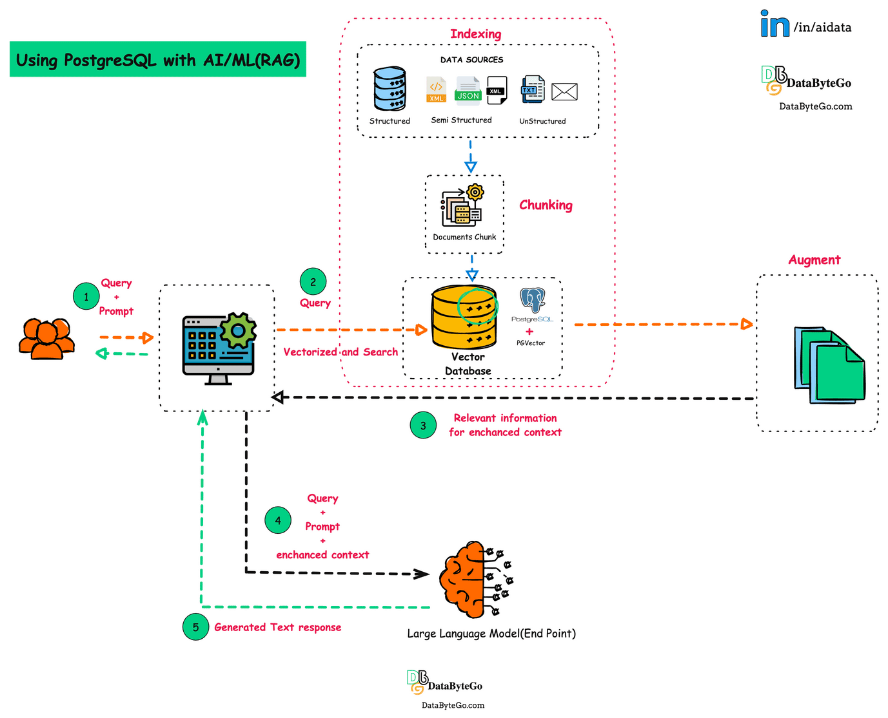

# **RAG Templates** 

This repository provides a collection of template notebooks showcasing Retrieval-Augmented Generation (RAG) applications with different Large Language Models (LLMs). Each notebook demonstrates RAG implementation using a specific LLM for response retrieval.

## **What is RAG?**

Retrieval-Agmented Generation(RAG) is a process that aims to optimize the output of the Large Language Model. It references an external knowledge source(documents, pdfs etc) or knowledge base outside it's training data sources before generating a response.

We use the RAG technique to overcome the problem of cut-knowledge to the LLM. It also helps to reduce the hallucination of the language model.

<div align="center">
  <p align="center">RAG on fire</p>
  <p align="center">
    
  </p>
  <p align="center">src: https://www.databytego.com/p/aiml-brief-introduction-to-retrieval</p>
</div>


In this repo, I used the RAG with data from URL to keep the code as simple as possible. It simply scrape the content of the page from it's URL, embedding it, store it in vectorestore (Chromadb) and use your query with the vectorstore as a retriever to answer your question. You can modify it to be able to deal with data from file or any other source but put in your mind to change the loader with each type of data sources.

## **What's included in this repo?**

* **RAG OpenAI:** this notebook utilizes OpenAI's GPT for retrieving information to augment response generation. Get your API key from [here](https://platform.openai.com/api-keys) (paid).
* **RAG Google:** this notebook leverages Google's Gemini LLM for the retrieval stage of the RAG pipeline. Get your API key from [here](https://ai.google.dev/gemini-api/docs/api-key) (free).
* **RAG Cohere:** this notebook uses Cohere's `command-r` model for the retrieving stage. Get your API key from [here](https://dashboard.cohere.com/api-keys) (free).
* **RAG HuggingFace:** get your API key from [here](https://huggingface.co/settings/tokens) (free).
* **RAG NLP Cloud:** get your API key from [here](https://nlpcloud.com/home/token) (free but with limited requests per hour).
* **RAG FireworksAI:** get your API key from [here](https://fireworks.ai/api-keys) (free).
* **RAG TogetherAI:** get your API key from [here](https://api.together.xyz/settings/api-keys) (free).


## **Benefits**

* **Rapid Prototyping:** these notebooks serve as a starting point for quickly building and RAG applications with various LLMs.
* **Flexibility:** easily swap out the LLM in each notebook to explore the capabilities of different models.
* **Code Examples:** learn best practices for implementing RAG with clear code examples in each notebook.

## **Getting Started**

1. **Clone the Repository:**

```bash
git clone git@github.com:mohamedhassan218/RAG-templates.git
```

2. **Install Dependencies:**

Each notebook contains it's needed dependencies you'll need to run it's cells.

3. **Run a Notebook:**

Open a Jupyter Notebook environment and navigate to the desired notebook file within the repository. Run the notebook cells to execute the RAG application with the corresponding LLM.

You can also use [Colab](https://colab.research.google.com/).


## **Contributing**

Contributions are highly appreciated so don't hesitate to submit a pull request. For any questions or issues, feel free to raise an issue on this repository.